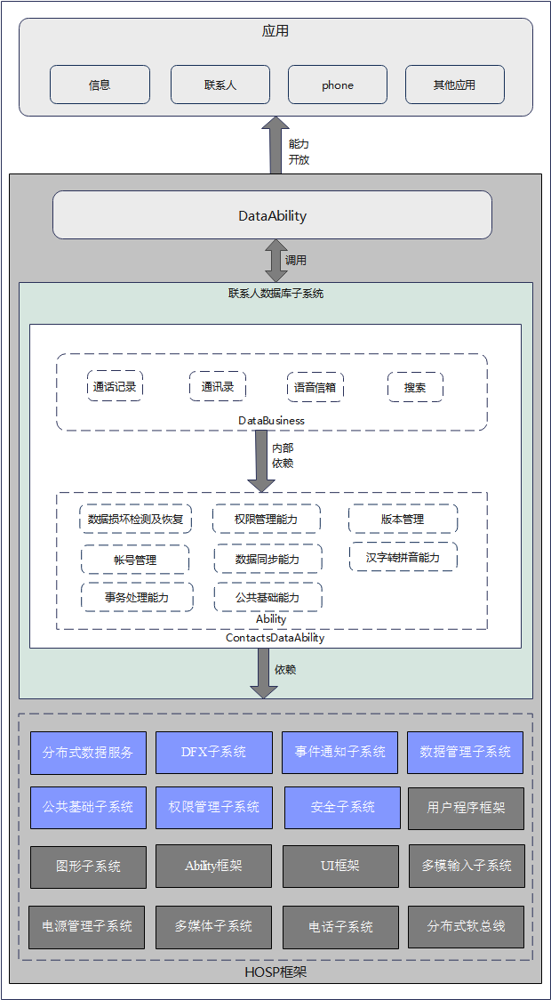

# applications_contactsdata<a name="ZH-CN_TOPIC_0000001122925147"></a>

-   [Introduction](#section1166054159366)
-   [Image architecture](#section1619419895966)
-   [Directory Structure](#section161941989596)
-   [Repositories Involved](#section1371113476307)

## Introduction<a name="section1166054159366"></a>

The contact database application is an indispensable management information application for every user to manage the contact database.
Its content is very important for user managers, so the contact database should be able to provide sufficient information and quick 
query means for each user's management, which greatly facilitates users to reasonably manage the contact database information.

## Image architecture<a name="section1619419895966"></a>



## Directory Structure<a name="section161941989596"></a>

```
/foundation/contactsdataability/
├── ability
│   ├── account                        #Account Management
│   ├── checkpermission                #Permission Check
│   ├── common                         #Public Method
│   ├── datadisasterrecovery           #Data Corruption Recovery
│   ├── merge                          #Contacts Merge
│   └── sinicization                   #Chinese Characters to Pinyin Related
├── contacts                            #NAPI
├── dataBusiness
│   ├── calllog                        #Call Records
│   ├── contacts                       #Contacts Person
│   ├── quicksearch                    #Quick Search
│   └── voicemail                      #Voicemail
├── test                               #Test Catalog
├── BUILD.gn
└── ohos.build
```

## Repositories Involved<a name="section1371113476307"></a>

system applications

applications_contactsdata